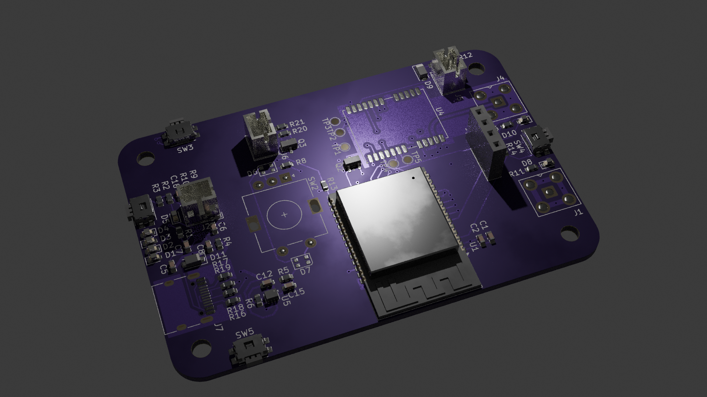
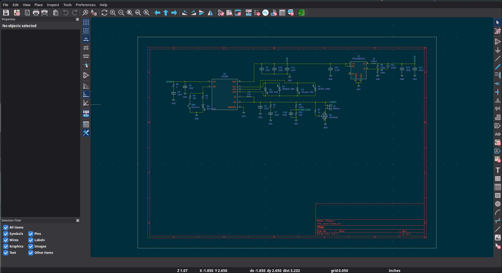
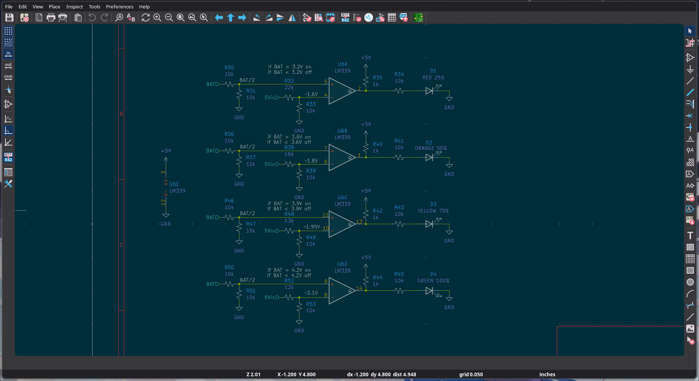

# Mesh-Hand

## Description
A Handheld Meshtastic Node with GPS on board. The device is designed to be compact and portable, making it ideal for outdoor activities such as hiking, camping, and other adventures.

## Why I Made This
I wanted to make a meshtastic node for a while and I heard about Hack Club Blueprint. I thought it would be fun to make a handheld meshtastic node and because it's a grant project, I don't need to worry about the cost of the components. I also thought it would be a great project to have on my portfolio.

## How to Use
1. Clone the repository
2. Download ~/kicad/production/mesh_hand.zip and use it to get PCBs
3. Assemble the PCB
4. Flash the firmware from meshtastic
5. Use the device as a meshtastic node

## Pictures
not done yet but add full 3d model screenshots and PCB renderings here and wiring diagram

## BOM
not done yet but a bom table here with links to the components and their prices

need to add step file
Handheld Meshtastic Node
GPS on board

Blender Render

Schematic & PCB View

Cart

+